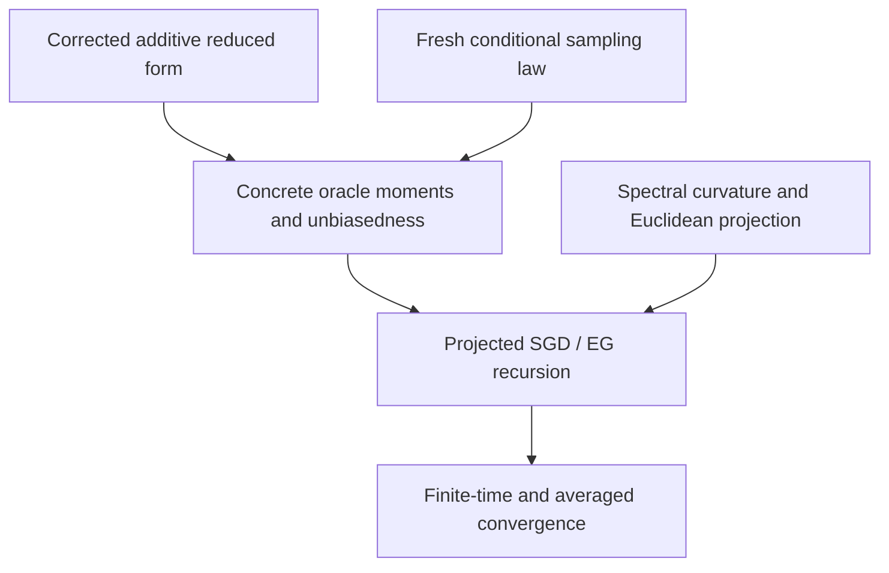

# NegDRO Formalization

NegDRO (Negative-Weighted Distributionally Robust Optimization) uses signed environmental
weights to promote risk invariance across environments. This project Lean-verifies a
finite-dimensional stochastic NegDRO extension combining projected stochastic primal descent
with exponentiated-gradient dual ascent. Under a corrected realized
additive-intervention reduced-form model, a universal fresh conditional sampling law,
fourth-moment bounds, a spectral heterogeneity condition, and a nonempty closed convex feasible
set, it derives explicit finite-time, averaged-iterate, and inverse-square-root expected
squared-error bounds. It is not a literal formalization of Algorithm 1 in
[arXiv:2412.11850v3](https://arxiv.org/abs/2412.11850v3).

The project gives a complete Lean-verified conditional convergence proof for this
finite-dimensional corrected-additive-model, fresh-sample, nearest-point-projected SGD/EG
extension. Concrete oracle unbiasedness, moment bounds, oracle integrability, entropy regret,
primal recursion, spectral curvature, Euclidean projection, finite-time bounds,
averaged-iterate bounds, and inverse-square-root rates are derived from the final stated model,
sampling, moment, spectral, and feasible-set assumptions. Here "complete" is relative to those
explicit mathematical hypotheses; it does not mean assumption-free.

[Mathematical Note](note/main.pdf) ·
[Theorem Map](docs/THEOREM_MAP.md) ·
[Assumption Ledger](docs/ASSUMPTION_LEDGER.md)

Detailed scope and cross-references are in:

- [Formalization coverage](docs/FORMALIZATION_COVERAGE.md)
- [Theorem map](docs/THEOREM_MAP.md)
- [Assumption ledger](docs/ASSUMPTION_LEDGER.md)
- [Completion roadmap](docs/COMPLETION_ROADMAP.md)

## Main result

The six public entry points prove finite-time and averaged-iterate expected squared-error bounds,
plus inverse-square-root specializations for equal step sizes. The complete theorem statements and
constants appear below; their dependency chain is recorded in the theorem map.

## Main algorithm

For rounds `t = 0, ..., T - 1`, the formalized recursion is

$$
b_{t+1}=P_C\left(b_t-\eta_b\widehat g_t^b\right),
\qquad
w_{t+1,i}=
\frac{w_{t,i}\exp(\eta_w\widehat g_{t,i}^w)}
{\sum_j w_{t,j}\exp(\eta_w\widehat g_{t,j}^w)}.
$$

Here `P_C` is the actual nearest-point projection onto a nonempty closed convex set, constructed
in `EuclideanSpace ℝ (Fin p)` and transported back to coordinate vectors. The concrete
single-sample oracles for a uniformly selected environment `e` and observation `(x,y)` are

$$
\widehat g^b_i
=2m\left(w_e-\frac{\gamma}{1+\gamma m}\right)
  (x^\top b-y)x_i,
$$

$$
\widehat g^w_j
=m(y-x^\top b)^2\mathbf 1\{j=e\}-2\mu w_j.
$$

Thus the primal update is descent and the dual update is ascent. Both oracles may use the same
sample; no independence between the primal and dual stochastic gradients is assumed. The joint
state starts at `bInit` and the algorithmic dual initialization `uniformWeight m`. The argument
named `w0` in the final assumption structure is instead a deterministic simplex comparator and
spectral witness; it is not the algorithmic initial weight.

## Main verified results

The final entry points, all in
[`AdditiveInterventionSamplingProjectedConvergence.lean`](NegDROFormalization/AdditiveInterventionSamplingProjectedConvergence.lean),
are:

1. `stochasticNegDRO_additiveSampling_projected_unpenalized_convergence`
2. `stochasticNegDRO_additiveSampling_projected_unpenalized_averaged_convergence`
3. `stochasticNegDRO_additiveSampling_projected_unpenalized_invSqrt_rate`
4. `stochasticNegDRO_additiveSampling_projected_penalized_convergence`
5. `stochasticNegDRO_additiveSampling_projected_penalized_averaged_convergence`
6. `stochasticNegDRO_additiveSampling_projected_penalized_invSqrt_rate`

Write

$$
D_T=\frac1T\sum_{t=0}^{T-1}\mathbb E\|b_t-\beta^\star\|_2^2,
\qquad
\bar b_T=\frac1T\sum_{t=0}^{T-1}b_t.
$$

The unpenalized finite-time theorem proves

$$
D_T\le
\frac{\|b_{\rm Init}-\beta^\star\|_2^2}{2\lambda\eta_bT}
+\frac{\|v_{\rm SEM}\|_2^2}{\lambda^2(1+\gamma m)^2}
+\frac{2\log m}{\lambda\eta_wT}
+\frac{\eta_wG_{w,0}^2}{\lambda}
+\frac{\eta_bG_b^2}{2\lambda}.
$$

The penalized theorem has the same form with `G_{w,0}^2` replaced by `G_{w,μ}^2` and the
additional structural bias `2μ/λ`. The constants are definitions in
[`ConcreteOracleMomentBounds.lean`](NegDROFormalization/ConcreteOracleMomentBounds.lean):

$$
G_b^2=4m\left(2\sqrt{K_YK_X}+2B^2K_X\right),
$$

$$
G_{w,0}^2=m^2(8K_Y+8B^4K_X),
\qquad
G_{w,\mu}^2=2m^2(8K_Y+8B^4K_X)+8\mu^2.
$$

These symbols already denote squared moment bounds; the Lean development does not square them
again. With `η_b = η_w = 1 / sqrt T`, the rate theorems normalize the bounds to

$$
D_T\le B_{\rm id}+\frac{C_0}{\sqrt T},
\qquad
D_T\le B_{\rm id}+\frac{2\mu}{\lambda}+\frac{C_\mu}{\sqrt T},
$$

where `B_id`, `C_0`, and `C_μ` are exactly `explicitIdentificationBias`,
`explicitUnpenalizedRateConstant`, and `explicitPenalizedRateConstant`.

These are expected squared-error statements. The averaged theorems bound
`E ‖bar b_T - betaStar‖₂²` by the same right-hand sides. They are not last-iterate theorems.
The separate theorem `rms_le_sqrt_bias_add_quarter_rate` is only an RMS square-root consequence;
it does not identify RMS error with an expected norm.

The final projected assumption bundle has 30 fields. In particular, callers no longer supply
coordinatewise primal/dual oracle integrability, primal `sqNorm` integrability, or dual
coordinate-bound-square integrability. [`OracleIntegrabilityBridge.lean`](NegDROFormalization/OracleIntegrabilityBridge.lean)
derives them from the fresh selected-environment fourth moments, bounded feasible trajectory,
simplex EG trajectory, and oracle measurability.

## Verified proof pipeline



## Important source correction

The development follows the algebra implied by Eq. (10) of the official v3 PDF. Direct
elimination from

$$
Y=\beta^{\star\top}X+\varepsilon_Y,
\qquad
X=B_{YX}Y+B_{XX}X+\varepsilon_X
$$

gives a lower-left inverse block with `+ G^T B_YX`. Appendix E.1 Eq. (97) instead prints a
negative sign. The negative cross terms subsequently printed in `H` also conflict with the
displayed positive-block PSD factorization. The Lean model therefore uses the corrected positive
sign forced by Eq. (10); it does not claim to verify the inconsistent printed Eq. (97) identity.

## Scope boundary

> **This is not a literal formalization of Algorithm 1 in arXiv:2412.11850v3.**

Official Algorithm 1 exactly maximizes the empirical penalized risk over `w` at every round and
then takes a primal gradient step. This project instead studies simultaneous fresh-sample
projected stochastic primal descent and exponentiated-gradient dual ascent. The project also
accepts the realized reduced-form objects `GT`, `BYX`, `etaY`, `etaX`, and `delta` at its final
entry point; it does not reconstruct that entry point from a complete acyclic block SEM.

The conclusions concern expected squared error, its time average, and the expected squared error
of the averaged iterate. There is no last-iterate, high-probability, or expected-norm theorem, and
the project does not construct a product probability space or an infinite i.i.d. stream.

## Repository structure

- `NegDROFormalization/`: the 50 Lean source modules.
- `NegDROFormalization.lean`: the root import covering every project module.
- `docs/`: coverage, theorem-map, assumption-ledger, and completion-roadmap documentation.
- `note/`: the finalized mathematical note, its TeX source, and included section files.
- `.github/workflows/lean.yml`: the Lean build workflow.

## Reproducing the Lean build

The repository pins:

- Lean `v4.34.0-rc2` in `lean-toolchain`;
- Mathlib commit `85e3a25e006c35636f0e53b0e9296caca2685bc0` in `lake-manifest.json`.

From this directory, first obtain Mathlib's precompiled cache, then build the project:

```bash
lake exe cache get
lake build
```

The cache step is recommended so that Mathlib is not rebuilt from source. `lake build` is the
actual project build. Dependency resolution and the initial cache download require network access.

To inspect the kernel dependencies of a theorem, create a temporary Lean file such as:

```lean
import NegDROFormalization

#print axioms NegDRO.stochasticNegDRO_additiveSampling_projected_unpenalized_convergence
```

and run:

```bash
lake env lean AxiomCheck.lean
```

The current local source scan contains no `sorry`, `admit`, or custom axiom declarations. Local
`#print axioms` checks for the projection and final convergence theorems report only `propext`,
`Classical.choice`, and `Quot.sound`, the standard foundations used through Mathlib. These are
statements about the checked working tree and local build. They are not a claim that an external
party has independently reproduced the build or audited every source-level modeling choice.

## Mathematical note

The finalized note is available as [`note/main.pdf`](note/main.pdf). Its reproducible TeX source is
[`note/main.tex`](note/main.tex), with included files under `note/sections/`. The current typography
uses XeLaTeX, the `algorithm2e` and `xeCJK` packages, and the macOS `PingFang SC` font. A verified
PDF is tracked because that font is platform-specific.

## Attribution and release status

The mathematical setup originates in the NegDRO work of Wang, Hu, Bühlmann, and Guo linked
above; the projected stochastic SGD/EG result formalized here is the extension developed in this
project. Authorship, acknowledgment wording, repository license, and citation metadata remain to
be confirmed before a public v1.0 release. This repository is a private release candidate; no
public release or third-party certification is claimed.
